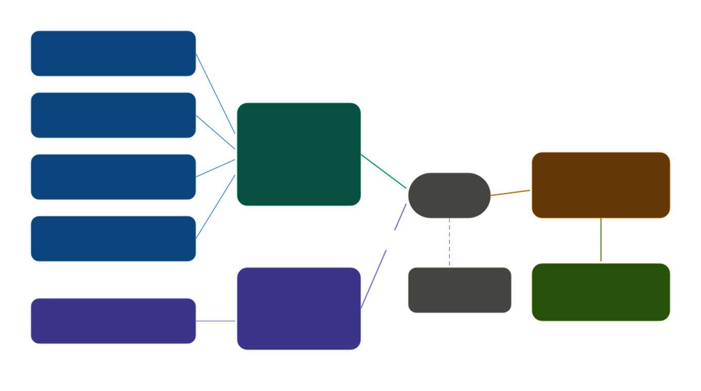
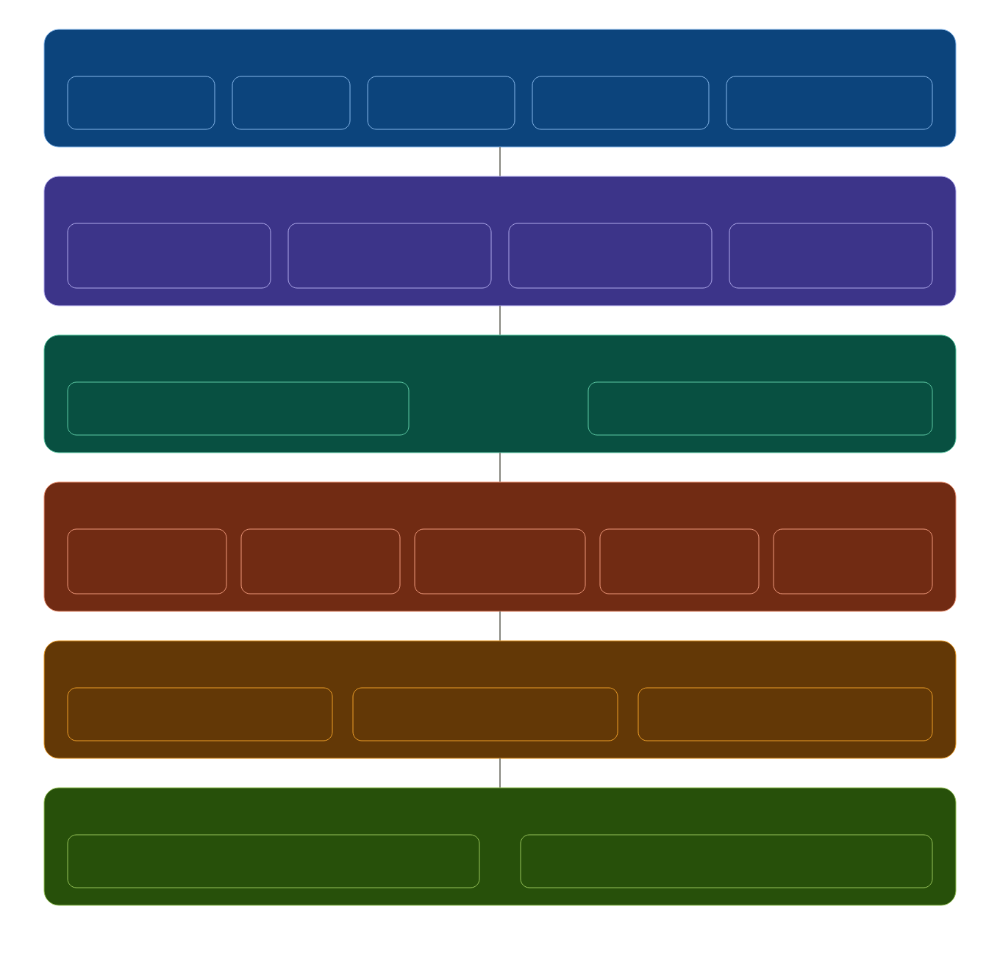
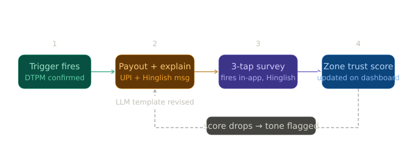

# RainReady - AI-Powered Parametric Income Insurance for India's Delivery Workers

> Guidewire DEVTrails 2026 | Unicorn Chase
> Protecting the income of Zomato, Swiggy & Blinkit delivery partners against uncontrollable external disruptions.

---

## The Problem

India's food and grocery delivery workers — the people behind every Zomato order and every Blinkit 10-minute delivery — lose 20–30% of their monthly income when the world outside stops cooperating. Heavy rain. Extreme heat. AQI emergencies. Unplanned bandhs. When these events hit, platforms stop assigning orders. Workers sit idle. There is no safety net.

Existing insurance products don't help. Government schemes cover accidents and health. Platforms cover liability during active rides. Nobody covers **lost income from external disruptions** — the single biggest financial risk a delivery worker actually faces week to week.

**RainReady fixes this.**

---

## The Solution

RainReady is a **dual-trigger parametric income insurance platform** built specifically for Zomato, Swiggy, and Blinkit delivery partners. Workers pay a small weekly premium. When a verified external disruption hits their zone, coverage activates automatically. No claim forms. No waiting. Payout lands in their UPI within minutes.

### Admin Operations (Current)

The admin dashboard now supports operational review workflows needed for demos and manual controls:

- Trigger source health view (Open-Meteo, WAQI, SACHET, order proxy, bandh)
- Pending-claim review with fraud reasons and approve/reject actions
- Zone control (bandh activate/clear)
- Simulation presets and day-by-day timeline replay
- **Driver directory**: fetch, search, and inspect driver details (identity, platform, trust tier, KYC, income/hours)

### What Makes This Different

Most parametric systems use a single trigger — "it rained, here's money." The problem is **basis risk**: it rained in one part of the city but your zone was fine, or the platform was still running deliveries. A single weather reading is not proof of income loss.

RainReady uses a **Dual-Trigger Parametric Model (DTPM)**:



This eliminates false payouts and makes the model financially viable — a critical differentiator from a real insurance architecture standpoint.

Additionally, thresholds are **not hardcoded**. They are written to a `zone_config` table in the database and recomputed weekly by the adaptive ML engine, which learns each zone's historical baseline and seasonal patterns. A threshold that made sense for Whitefield in January is automatically recalibrated for the monsoon peak in July.

---

## Delivery Persona

**Primary:** Zomato food delivery partners + Blinkit grocery delivery partners
(Blinkit is a Zomato subsidiary — same worker pool, unified risk model)

**Secondary:** Swiggy food + Swiggy Instamart partners

**Target geography (Phase 2):** Bengaluru — 4 zones: Whitefield, Koramangala, HSR Layout, Indiranagar

**Scale target (Phase 3):** 6 metro cities

---

## Architecture Overview



**Critical design principle:** The LLM never makes financial decisions. It only explains decisions already made by the deterministic rules engine — in plain Hinglish to the worker. All payout logic is fully auditable.

---

## Parametric Triggers

| Trigger | Source | Threshold | Type |
|---------|--------|-----------|------|
| Heavy Rainfall | Open-Meteo | >50mm/hr sustained 45min | Environmental |
| Extreme Heat | Open-Meteo | >44°C for 3+ consecutive hours | Environmental |
| Severe AQI | WAQI API | AQI >300 (Hazardous) | Environmental |
| NDMA Red Alert | SACHET RSS Feed | Any Red/Orange district alert | Official Govt |
| Zone Order Drop | Platform Activity Proxy | >60% drop vs 7-day rolling avg | Activity |
| Social Disruption | Bandh signal mock | Keyword-confirmed curfew/strike | Social |

All thresholds are **zone-relative** — written to the `zone_config` table and recalibrated weekly against each zone's rolling 90-day baseline. A threshold is never hardcoded.

---

## Weekly Premium Model

Premium is calculated dynamically every week per worker using a trained XGBoost model:

```
Weekly Premium = Base Rate × Zone Risk Multiplier × Season Factor × Worker Tenure Discount
                                                                   × Earnings Velocity Factor

Base Rate: ₹35/week (covers up to ₹1,500 income protection)

Zone Risk Multiplier: 0.8x (low-flood zone) to 1.4x (high-flood zone) — recalibrated weekly
Season Factor: 1.0 (dry) to 1.6 (monsoon peak, June–September)
Tenure Discount: -5% per 3 months active, max -20%
Earnings Velocity Factor: adjusts coverage based on worker's personal hourly earning rate

Example: Whitefield zone, monsoon season, new worker
₹35 × 1.3 × 1.5 × 1.0 = ₹68.25/week
```

Premium is deducted from the worker's linked UPI every Monday morning via Razorpay.

### Payout Precision via Earnings Velocity Profiling

Rather than a flat payout amount, RainReady models each worker's hourly earning rate across time of day, day of week, zone, and season. When a disruption fires, the payout reflects the **actual estimated income lost** during that window — not a generic flat amount. A worker who earns ₹800/day receives proportionally more coverage than one earning ₹400/day.

### Disruption Severity Scoring

Triggers are not binary. Each disruption event receives a severity score (0–100):

```
Severity score = f(T1 intensity, T2 order drop magnitude)

Score 0–40:   No payout (disruption below threshold)
Score 41–60:  50% payout
Score 61–80:  75% payout
Score 81–100: 100% payout
```

This reduces insurer loss ratio, prevents gaming edge-case thresholds, and produces more defensible payout decisions.

---

## Novel Features

### Forecast Shield (Predictive Coverage Upgrade)

When Open-Meteo's 6-hour forecast predicts >70% probability of threshold breach, RainReady sends the worker a proactive Hinglish alert: "Kal Whitefield mein baarish ka alert hai — aaj coverage upgrade karo ₹8 mein?" Workers can opt into an enhanced coverage tier before the event.

### Solidarity Pool for Social Disruptions

For bandh and curfew events that simultaneously affect large numbers of workers, individual policy payouts are supplemented by a **Solidarity Pool** — a separate fund built from a ₹5/week opt-in surcharge. When ≥30% of zone workers are affected simultaneously, payouts draw from the solidarity pool rather than individual policies.

### Post-Payout Trust Feedback Loop

Immediately after every payout, a 3-question in-app survey fires in Hinglish. Responses generate a **zone trust score** per zone per week on the admin dashboard. If a zone's trust score drops, the LLM explanation template for that zone is flagged for tone revision.



### Worker Trust Tier

Workers build a trust tier over time — Trusted Partner, Rising Partner, New Partner — based on GPS validation history and claim patterns. Higher tiers unlock faster payout speeds (under 2 minutes vs standard 10 minutes) and eligibility for higher coverage amounts.

### Income Smoothing (Phase 3)

Opt-in micro-savings layer. In high-earning weeks, the platform retains a small voluntary buffer (₹50–100 with worker consent). When a low-earning week or uncovered disruption occurs, RainReady draws from this buffer to cover the worker's next premium automatically.

---

## Fraud Detection

| Mechanism | What It Catches |
|-----------|----------------|
| GPS zone validation | Worker phone not in claimed disruption zone at trigger time |
| Activity cross-check | Worker had active deliveries during claimed disruption window |
| Duplicate trigger guard | Same event cannot trigger multiple claims per worker |
| Isolation Forest anomaly score | Claim pattern deviates from worker's own historical baseline |
| Velocity check | More than 2 claims in 7 days flags for manual review |
| T2 cliff-edge detection | Coordinated simultaneous offline = fraud ring, not real disruption |
| Parametric Honeypot | Fake internal alerts — any claim on a non-event is definitionally spoofing |

---

## Adversarial Defense & Anti-Spoofing Strategy

### The T2 Manufacturing Attack (RainReady-specific)

Our payout requires both T1 (weather signal) and T2 (zone order drop) to fire simultaneously. A GPS spoof alone doesn't work because T2 watches platform order activity, not worker location. A smart fraud ring would coordinate workers to go offline simultaneously, manufacturing the T2 signal. Defense: compare order drop *shape* against historical signatures. Real disruptions show a gradual curve. Coordinated attacks show a cliff edge — simultaneous drop, simultaneous recovery. The cliff pattern doesn't exist in 90-day baseline data.

### The Parametric Honeypot

RainReady publishes fake disruption alerts internally to zones with no real disruption. These alerts never trigger real payouts — they exist only inside the system. Any account claiming on a fake alert is definitionally spoofing. No genuine worker would claim on an event they didn't experience.

### Standard Defenses

**GPS trajectory consistency** — randomised-interval pings, not single timestamp. Spoofing scripts can't predict when to show the right coordinate.

**Cross-signal fingerprint** — GPS can be spoofed at the app layer. Cell tower triangulation cannot. If GPS says Koramangala but towers say Marathahalli, the contradiction is unresolvable without physically being there.

**Ring detection** — claim timing clustering, device fingerprint clustering, network origin clustering, payout destination clustering.

**Isolation Forest** — personal behavioral baseline per worker. Long-tenured clean workers get benefit of the doubt; new accounts with suspicious fingerprints get quarantined.

**Flagged = quarantined, never denied.** Manual review within 24hr. Hinglish notification. Appeal mechanism. Trusted Partner tier gets higher anomaly threshold before quarantine triggers.

---

## LLM Communication Layer

The Groq API (Llama 3.1 8B) powers all worker-facing communication in Hinglish. The LLM is used for:

- **Proactive disruption alerts** — "Kal Whitefield mein 67mm baarish ka IMD alert hai. Tera coverage active hai."
- **Post-payout explanation** — "Aaj baarish ki wajah se orders band the. ₹340 tera UPI mein aa gaya."
- **Onboarding flow** — conversational insurance setup, not a form
- **Payout status queries** — "Mere paise kab aayenge?" handled naturally
- **Coverage upgrade prompts** — Forecast Shield notifications

The LLM **never** makes any financial decision. All decisions (trigger fired, payout amount, fraud flag) are made by the deterministic rules engine and the ML models. The LLM only communicates decisions already made.

**Fallback:** If no Groq API key is configured, the system falls back to templated Hinglish messages automatically. The app works fully without the LLM layer.

---

## Tech Stack

| Layer | Technology | Reason |
|-------|-----------|--------|
| Worker frontend | React Native + Expo (Phase 3) / React PWA (Phase 2) | Real device target, Expo Go for judge demos |
| Admin frontend | React 18 + Vite + TailwindCSS | Web is correct for admin/insurer |
| Backend | Python 3.11 + FastAPI | Async, typed, excellent for data pipelines |
| Database | PostgreSQL (Docker for local, portable to Supabase/managed Postgres) | Stable relational core for policies, claims, and payouts |
| LLM | Groq API — Llama 3.1 8B | Judge machine compatible, fast inference, free tier, template fallback |
| ML models | scikit-learn (XGBoost + Isolation Forest) | Local training on seeded data, zero cost, serialized via joblib |
| Task scheduling | APScheduler in FastAPI (Phase 2) → Celery + Redis (Phase 3) | Complexity scales with need |
| Push notifications | Firebase Cloud Messaging | Free, Android-first, works with PWA and React Native |
| Payments | Razorpay Test Mode | Mock UPI payouts with real API shape |
| API caching | Redis TTL cache (5-min per zone) | Prevents rate limit hits across 4 zones × 4 APIs |
| Containerization | Docker + Docker Compose | One-command setup for judges |
| External APIs | Open-Meteo (free, no key), WAQI, SACHET RSS | All free tier / public |

---

## API Strategy

### Mock-First Runtime (for demos)

RainReady now runs in **mock-first mode** by default (`MOCK_MODE=true`) so judge demos are deterministic and do not depend on live external APIs.

- Open-Meteo integration serves deterministic offline weather values
- WAQI integration serves deterministic offline AQI values
- SACHET integration is offline-safe in mock mode
- Admin trigger health explicitly reports mock-mode source status

This keeps the full claim pipeline stable in local and Docker environments.

### Weather and Environmental (T1 Triggers)

**Open-Meteo** is the primary weather source — completely free, no API key required, returns hourly precipitation, temperature, and wind per lat/lng. Used as the default for all zone polling.

**WAQI** provides AQI data for 12,000+ stations globally. Bengaluru has strong coverage. Free token via signup, returns AQI + PM2.5 per station.

**SACHET RSS (NDMA)** is the government disaster alert feed. No auth required, public RSS/XML. Parsed for district-level Orange/Red alerts.

### Platform Activity Proxy (T2 Trigger)

No real platform API exists for order-rate data. A small FastAPI mock microservice returns `zone_order_rate` using a noise + weather-correlated formula. Historical baseline is seeded using Python Faker + pandas — 90 days of per-zone order data in Postgres, giving the 7-day rolling average real data to compare against.

### Social and Bandh Signals

A mock JSON endpoint controlled via the admin dashboard simulates bandh/curfew signals. Toggling a flag triggers the social disruption flow end-to-end.

---

## API Testing

A Postman collection and environment file are provided under `postman/` for all Phase 2 endpoints:

- `postman/RainReady_Phase2.postman_collection.json` — Full test suite covering registration, policy management, premium calculation, disruption simulation, claims pipeline, and admin endpoints. Each request includes test assertions on status codes, response schema, and business logic.
- `postman/RainReady.postman_environment.json` — Pre-configured environment with `base_url` and auto-captured variables (worker_id, policy_id, claim_id) set by Collection Runner test scripts.

Run the entire collection in sequence via Collection Runner to walk through the full happy path. The disruption simulation request triggers the complete DTPM pipeline end-to-end.

---

## Repository Structure

```
Guidewire_Project/
├── client/                        # React PWA frontend (worker + admin)
│   └── src/
│      ├── pages/                  # Home, onboarding, login, admin, worker dashboard
│      ├── api/                    # Axios API client
│      └── store/                  # Zustand auth/session store
├── server/                        # FastAPI backend
│   ├── main.py                    # App bootstrap + router registration
│   ├── auth.py                    # JWT/RBAC helpers
│   ├── routers/                   # auth, workers, policies, claims, disruptions, admin, llm
│   ├── services/                  # trigger, claims, payouts, fraud, premium, llm logic
│   ├── integrations/              # open_meteo, waqi, sachet, order proxy, razorpay mock
│   ├── jobs/                      # APScheduler polling and premium jobs
│   ├── models/                    # SQLAlchemy entities
│   ├── schemas/                   # Pydantic request/response models
│   ├── ml/                        # premium + fraud model artifacts/code
│   └── seeds/                     # zone and deterministic demo-user seeds
├── postman/
│   ├── RainReady_Phase2.postman_collection.json
│   └── RainReady.postman_environment.json
├── scripts/
│   └── seed_historical_data.py    # Historical baseline seed script
├── Makefile                       # Common dev tasks (up/down/seed)
├── docker-compose.yml             # One-command local setup
├── .env.example                   # API keys config — app works without LLM key
├── README.md                      # This file
└── SYSTEM.md                      # Internal architecture notes
```

---

## Phase Deliverables

### Phase 1 — Ideation and Foundation (March 4–20)
- [x] README with full strategy, architecture, and tech decisions
- [x] SYSTEM.md internal architecture brain
- [x] 2-minute strategy video

### Phase 2 — Automation and Protection (March 21–April 4)
- [x] Project scaffold — server (FastAPI) + client (React PWA)
- [ ] DB schema + migrations (portable PostgreSQL; formal Alembic migrations pending)
- [x] Historical baseline seeder (90-day mock data via Faker + pandas)
- [x] Worker registration + OTP login flow + admin login
- [ ] Insurance policy management (create/pause/update done; cancel flow pending)
- [x] Dynamic premium calculation — model-backed with deterministic fallback path
- [x] All 5 disruption triggers live (Open-Meteo, WAQI, SACHET, order-drop proxy, bandh mock)
- [x] Dual-trigger claims engine with severity scoring
- [x] Isolation Forest fraud detection in live claim path
- [ ] Earnings velocity profiling per worker (core payout approximation implemented; dedicated profiling module pending)
- [x] Razorpay mock payout simulation
- [x] Post-payout Hinglish survey — zone trust scores on admin dashboard
- [x] Groq LLM layer + Hinglish fallback templates
- [x] Postman test collection (Phase 2 full coverage)
- [ ] 2-minute demo video

### Phase 3 — Scale and Optimise (April 5–17)
- [ ] React Native + Expo worker app with real device GPS validation
- [ ] Forecast Shield — 6-hour predictive coverage upgrade via Open-Meteo forecast + FCM push
- [ ] Solidarity Pool — pooled risk model for social disruption events (≥30% zone affected)
- [ ] Income Smoothing — opt-in micro-savings buffer for premium auto-cover
- [ ] Worker Trust Tier system — Trusted / Rising / New Partner with payout speed tiers
- [ ] Instant payout simulation — Razorpay test mode + Twilio SMS sandbox
- [ ] Intelligent dual dashboard — worker view + admin insurer view with zone trust analytics
- [ ] Adaptive threshold recalibration — weekly `zone_config` recompute from 90-day rolling baseline
- [ ] Celery + Redis migration (from APScheduler) for distributed polling
- [ ] Postman test collection (Phase 3 additions)
- [ ] 5-minute walkthrough video — simulated disruption → auto payout end to end
- [ ] Final pitch deck PDF

---

## What We Are Not Building

RainReady strictly excludes the following per the problem statement constraints:

- Health insurance or accident medical bills
- Vehicle repair or maintenance coverage
- Life insurance of any kind
- Any coverage for events within a worker's control

All payouts are triggered exclusively by verified external disruptions causing loss of income. The system is designed so these exclusions are enforced at the trigger definition level — no trigger exists that could fire for a covered exclusion.

---

## Edge Cases and Systemic Risk Boundaries

### Single Restaurant Closures

If one restaurant closes, the T2 trigger won't move — zone order drop rate won't shift enough from one restaurant going dark. If an LPG shortage closes enough restaurants simultaneously, T2 fires naturally. No dedicated trigger needed; the model catches systemic supply failures by measuring outcomes rather than causes.

### Fraud Prevention on Prolonged Disruptions

Each worker's policy enforces a **maximum consecutive trigger cap** of 4 weeks. Beyond that, claims move to manual review. The Isolation Forest model also flags workers whose claim frequency deviates from their own historical baseline and zone-wide peer patterns.

### Truly Systemic Events — COVID-Scale Disruptions

RainReady is designed for recoverable, zone-level disruptions. For economy-wide indefinite disruptions: proportional drawdown from the Solidarity Pool applies first; if reserves fall below the floor, new auto-payouts suspend and the reserve is held for manual disbursement. This boundary is intentional — good insurance design means knowing what you're not covering.

---

## Team

Shubhang, Puranddar, Kanishk, Nahush, Krishna — PES University
Guidewire DEVTrails 2026 | Built with FastAPI · React (PWA) · PostgreSQL · Groq · scikit-learn

---

*RainReady is not affiliated with Zomato, Swiggy, Blinkit, or Razorpay. All worker data is simulated for hackathon purposes.*
